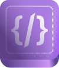

<p align="center">
  <a href="https://github.com/magayaga/kodigo">
    
  </a>
</p>

<h1 align="center">Kodigo</h1>

**Kodigo** (Filipino for **"Code"**) is a free and open-source source-code editor was created and developed by [Cyril John Magayaga](https://github.com/magayaga). It is written in HTML, CSS, JavaScript, and CoffeeScript. 

Kodigo is successor of [CyCode](https://github.com/magayagalabs/CyCode). CyCode is a free and open-source **HTML** Editor, **Markdown** Editor, and **WYSIWYG** Editor unlike syntax highlighting, code snippets, code refactoring, and intelligent code completion.

## Project Structure
Create a project directory and structure it as follows:

```
kodigo/
├── package.json
└── src/
    ├── assets/
    │   ├── addons/
    │   │   ├── edits/
    │   │   ├── folds/
    │   │   ├── hints/
    │   │   └── selects/
    │   ├── fonts/
    │   │   ├── andale-mono/
    │   │   ├── apple-sf-mono/
    │   │   ├── fira-code/
    │   │   ├── ibm-plex-mono/
    │   │   ├── jetbrains-mono/
    │   │   ├── roboto-mono/
    │   │   ├── source-code-pro/
    │   │   ├── space-mono/
    │   │   └── ubuntu-mono/
    │   ├── logos/
    │   ├── modes/
    │   │   ├── coffeescript.js
    │   │   ├── css.js
    │   │   ├── htmlmixed.js
    │   │   ├── javascript.js
    │   │   ├── markdown.js
    │   │   └── python.js
    │   ├── scripts/
    │   │   ├── bootstrap-bundle.js
    │   │   ├── codemirror.js
    │   │   ├── function.coffee
    │   │   ├── main.coffee
    │   │   ├── script.js
    │   │   └── snippets.coffee
    │   ├── styles/
    │   │   ├── bootstrap.css
    │   │   ├── codemirror.css
    │   │   └── style.css
    │   └── themes/
    │       ├── darcula.css
    │       ├── erlang-dark.css
    │       ├── moonlight-wheat.css
    │       ├── neo.css
    │       ├── rubyblue.css
    │       ├── tomorrow-night-bright.css 
    │       └── zenburn.css
    ├── index.html
    └── about.html*
```

## Getting start

**Running Kodigo**

```shell
# Download the Git
$ git clone https://github.com/magayaga/kodigo
$ cd kodigo

# Install the npm dependencies
$ npm install

# Running Electron framework
$ npm run kodigo
```

**Building Kodigo**

```shell
# Default the operating system (Electron packager)
$ npm run kodigo-build
```

## Copyright and License
Copyright (c) 2023 Cyril John Magayaga

Licensed under the [MIT license](LICENSE).